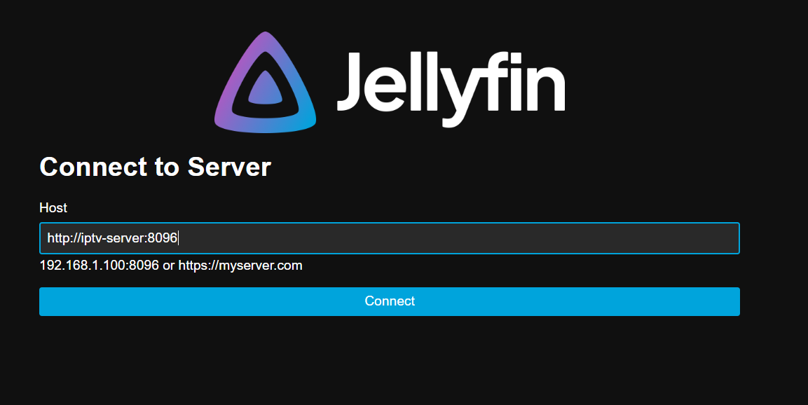
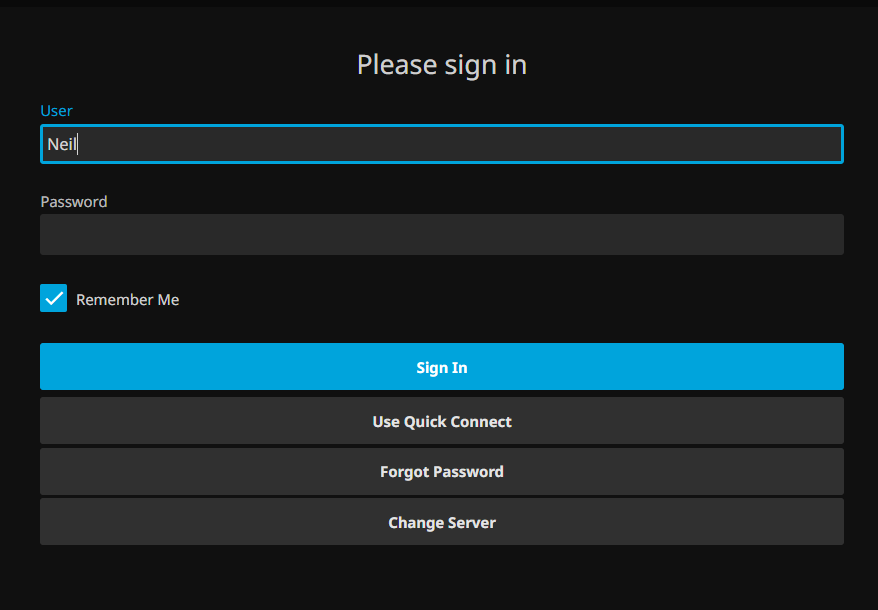

# JellyFin App

_This assumes that you already have Tailscale installed and connected to my Tailnet_

## App Setup

1. Open the JellyFin app.

2. Type in this URL and hit connect after you successfully type it in. Make sure to double check all of the punctuation.

3. Enter `Neil` as the username. There is no password, but if prompted for a password, just hit enter/connect without typing in anything for the password.

4. You should be logged into the app and be able to search for your media.