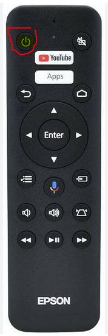
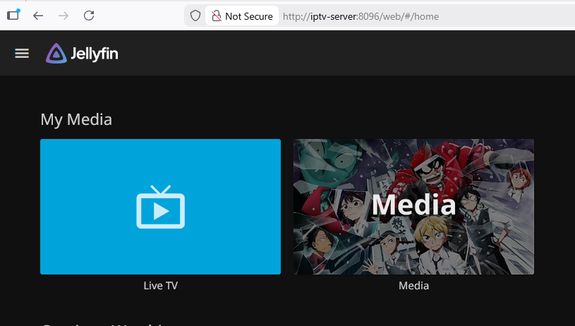

# Accessing JellyFin

### Turning on Projector

1. Turn on the projector with the power button.

2. Select the `HDMI` option when selecting the input

### Starting Firefox

*You will need the mouse for this and for most of the instructions.*

1. Once logged into the PC and the desktop is visible, select the firefox icon in the bottom taskbar.

2. Type this into the browser `http://iptv-server:8096`. It should be authenticated already.

3. Click on `Media`.
4. You can scroll to the show you are searching for, or you can search for it.

5. You can see the show and the episodes from there.

### Turning off the Projector

1. Press the power button once. It will ask for confirmation.
2. Press the power button again to confirm.