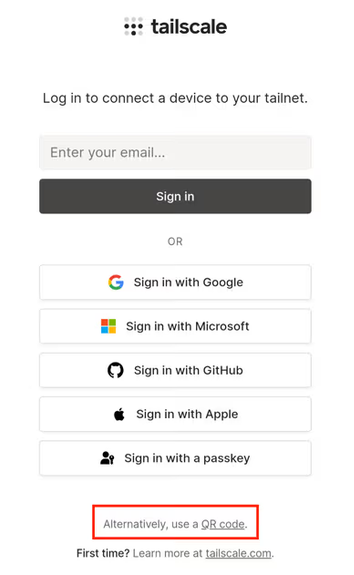

# Setting up Tailscale on IPhone

## Step 1: Install Tailscale on your iPhone

You can use [this](https://apps.apple.com/us/app/tailscale/id1470499037) link as well to access and install the app.

1. Open the **App Store** on your iPhone.
2. Search for **Tailscale** and install it.

## Step 2: Configure iOS VPN Permissions

When you open Tailscale for the first time, you must grant it permission to establish a local VPN tunnel.

1. On the initial screen, tap **Get Started** or toggle the main switch to **Connect**.
2. A system prompt will appear: *“Tailscale” Would Like to Add VPN Configurations*.
3. Tap **Allow**.
4. Enter your iPhone passcode or use Face ID / Touch ID to confirm and install the VPN profile.

## Step 3: Initiate the QR Code Authentication Flow

1. In the Tailscale app, tap **Log In** or switch the main connection toggle to **On**.
2. Click the sign in using QR code option.

## Step 4: Share the QR Code for Approval

To have an administrator approve your device onto the secure network:

1. Open messenger.
2. Attach the generated **QR Code image** or send it alongside the direct link.
3. Send it to Neil and he will approve your device.
