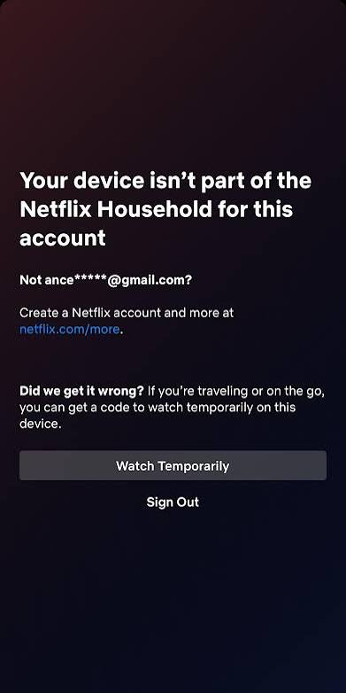

# Using an Exit Node

Usually you are using an exit node in order to have your traffic routed to an IP address that is friendly to the service you are trying to access.
Most of the time, this is done to access Netflix and their greedy household rules.
Sometimes, this is needed to bypass crappy DNS situations at your house.

## *Warning*

Smart TV apps suck. 
Don't try to attempt to use an exit node on a smart TV to do these steps.
Even though this is all possible, UIs on all smart TV apps are horrible and they design these operating systems on TVs to minimise the abilities you have access to exploring the public internet. 
They spy on you and you are limited in compute resources.

Do these steps on a smart phone or a desktop computer.

Once this is done on one device, all devices within your household will be granted 30 day access to Netflix, including smart TV apps.
This is because all devices in your house share the same IP address and one device with valid 30 day auth is tranferred to all devices with the same IP address.

If you see this image on the browser or app for Netflix:

Then you will need to proceed with these steps.

# Steps

This is assuming you are already authenticated with Tailscale.
If not, then read [this](./tailscale-app.md).

## Android

1. Verify your current IP address by going to [this](https://whatismyipaddress.com/) site. 

2. Open the Tailscale app and click on the exit node settings.

3. Select the `iptv-server` exit node from the list.

4. Your app should look like this now.

5. Verify your current IP address by going to [this](https://whatismyipaddress.com/) site. Is should be different from what was previously recorded in step 1.

### Netflix Specific Steps

6. Open the Netflix app, sign in if you have not, and start watching a video for a couple minutes to ensure you have valid auth from our household.

7. Disable the exit node. This will only slow your internet connection down on your device if it is left enabled.

## Windows

1. The steps are roughly the same, except this is done in a small process window at the bottom of your screen with the `^` sign.

2. Right click the Tailscale process below.

3. Select the `iptv-server` exit node.

4. You will see this if an exit node is enabled.

5. Repeat the steps in the [Netflix Specific Steps](#netflix-specific-steps).

6. Disable the exit node by selecting none in the list. This will only slow your internet connection down on your device if it is left enabled.

